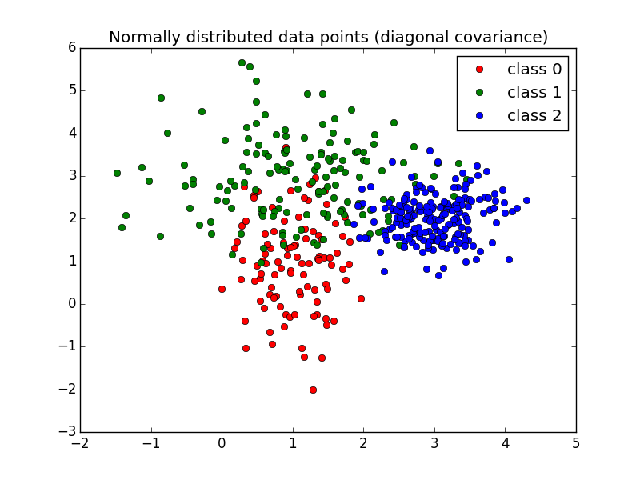

==================================================================
abx_numpy: Small ABX evaluation
==================================================================

.. image:: https://travis-ci.org/bootphon/abx_numpy.svg?branch=master
    :target: https://travis-ci.org/bootphon/abx_numpy

This package is a simpler version of the `ABXpy
<https://github.com/bootphon/ABXpy>`_ package, for smaller task with
less constraints.

Input and output format are easier to use.

Installation
------------

::

   $ python setup.py build && python setup.py install

Usage
-----

To do an ABX evaluation:

.. code-block:: python

  import numpy as np
  from abx_numpy import abx

  # generate 120 random features of dimension 4 splitted in 3 classes
  features = np.random.randint(0, 10, (120, 4))
  classes = np.array(np.random.randint(0, 4, (120,)), dtype='S1')

  # compute the ABX discrimination score
  distance = lambda x, y: np.linalg.norm(x-y)
  abx(classes, features, distance)

The main function (abx) takes as input:

* classes: list, [n_items], the class to which each items
  belong (any type). E.g. ['class 1', 'class 1', 'class 2'].

* features: array_like, [n_items, n_dim], the features for each
  items (in the same order as classes, any type). E.g. [[2, 3], [1, 3], [5, 4]]

* distance_function: callable, distance function to use for the
  calculation. E.g. euclidian distance. There are example of distances
  in the 'distances' module.

Example
-------

See '2D_normal_example.py' in 'examples/' for the code. A dataset is
randomly generated: datapoints from 3 classes are sampled from 3
different gaussians. We evaluate the ABX discriminability between
those 3 classes.

Average abx score: **0.82**

This score correspond to the proportion of successful ABX trials
(chance level is at 0.5).

Discrimination matrix:

===== ==== ==== ====
class  1    2    3
===== ==== ==== ====
**1** N/A  0.76 0.85
**2** 0.64 N/A  0.74
**3** 0.96 0.95 N/A
===== ==== ==== ====

The results confirm what we can see: Class 1 is confused with Class 2
but not with Class 3. Class 2 is confused with both. And Class 3 is
confused with neither.

Note that the ordering of the array is the following: the score shown
is the discriminability of the class in the column when compared to the
class in the row. For instance, for the 1st row and 2nd column (0.76),
X and A are from class 1 and B is from class 2.

Documentation
-------------

Complete documentation can be found `here
<http://abx-numpy.readthedocs.org/en/latest/>`_.
