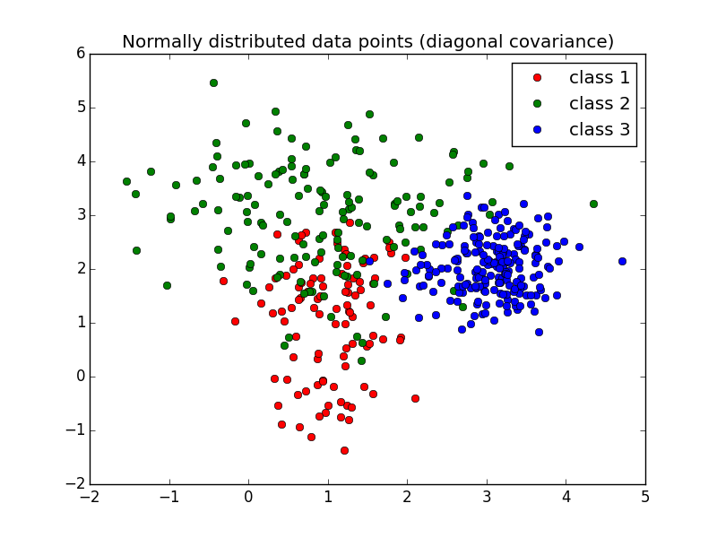

==================================================================
abx_numpy: Small ABX evaluation
==================================================================

.. image:: https://travis-ci.org/bootphon/abx_numpy.svg?branch=master
    :target: https://travis-ci.org/bootphon/abx_numpy

This package is a simpler version of the ABXpy package, for smaller task wth less constraints.

Input and output format are easier to use.

Installation
------------

::

   $ python setup.py build && python setup.py install

Usage
-----

To do an ABX evaluation::

  >> import numpy as np
  >> features = np.random.randint(0, 10, (120, 4))  # 120 items, 4 dimensionnal features
  >> classes = np.array(np.random.randint(0, 4, (120,)), dtype='S1')  # 3 classes
  >> from abx_numpy import abx
  >> abx(classes, features, lambda x, y: np.linalg.norm(x-y))

The main function (abx) takes as input:

  - classes: list, [n_items], the class to which each items belong. E.g. ['class 1', 'class 1', 'class 2'].
  - features: array_like, [n_items, n_dim], the features for each items (in the same order as classes). E.g. [[2, 3], [1, 3], [5, 4]]
  - distance_function: callable, distance function to use for the calculation. E.g. euclidian distance.

Example
-------

See '2D_normal_example.py' in 'examples/' for the code. A dataset is randomly generated: datapoints from 3 classes are sampled from 3 different gaussians. We evaluate the ABX discriminability between those 3 classes.

Average abx score: **0.82**

This score correspond to the proportion of successful ABX trials (chance level is at 0.5).

Discrimination matrix:

===== ==== ==== ====
class  1    2    3
===== ==== ==== ====
**1** N/A  0.76 0.85
**2** 0.64 N/A  0.74
**3** 0.96 0.95 N/A
===== ==== ==== ====

The results confirm what we can see: Class 1 is confused with Class 2 but not with Class 3. Class 2 is confused with both. And Class 3 is confused with neither.

Documentation
-------------

Complete documentation can be found `here <http://abx-numpy.readthedocs.org/en/latest/>`_.
